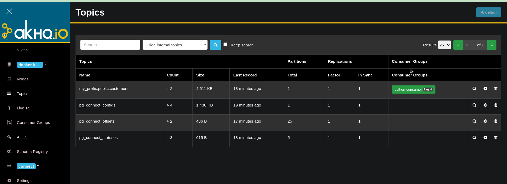
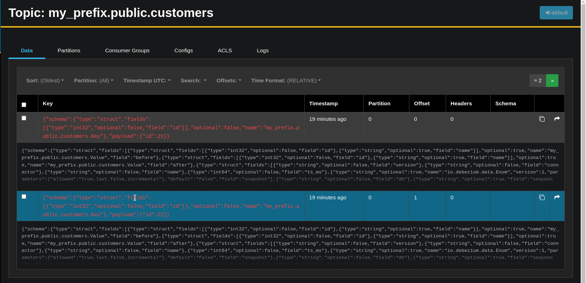
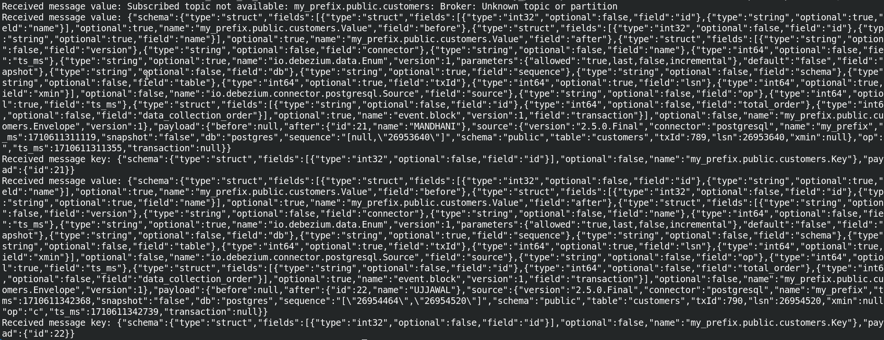

### List Connectors Api
```bash
curl -H "Accept:application/json" postgres-connector:8083/connectors/
```

### Creating postgres connector Api
```bash
curl -i -X POST -H "Accept:application/json" -H "Content-Type:application/json" postgres-connector:8083/connectors/ -d '{
    "name": "pg-orders-source",
    "config": {
        "connector.class": "io.debezium.connector.postgresql.PostgresConnector",
        "database.hostname": "postgres",
        "database.port": "5432",
        "database.user": "postgres_user",
        "database.password": "postgres_password",
        "database.dbname": "postgres",
        "database.server.name": "postgres",
        "plugin.name": "decoderbufs", 
        "topic.prefix": "my_prefix",
        "table.include.list": "public.customers",
        "value.converter": "org.apache.kafka.connect.json.JsonConverter"
    }
}'
```
### How to

```bash
docker-compose build 
docker-compose up -d
```

### Useful Links

For Kafka Configurations
https://github.com/confluentinc/librdkafka/blob/master/CONFIGURATION.md 

Article
https://medium.com/geekculture/listen-to-database-changes-with-apache-kafka-35440a3344f0

### ScreenShots 







